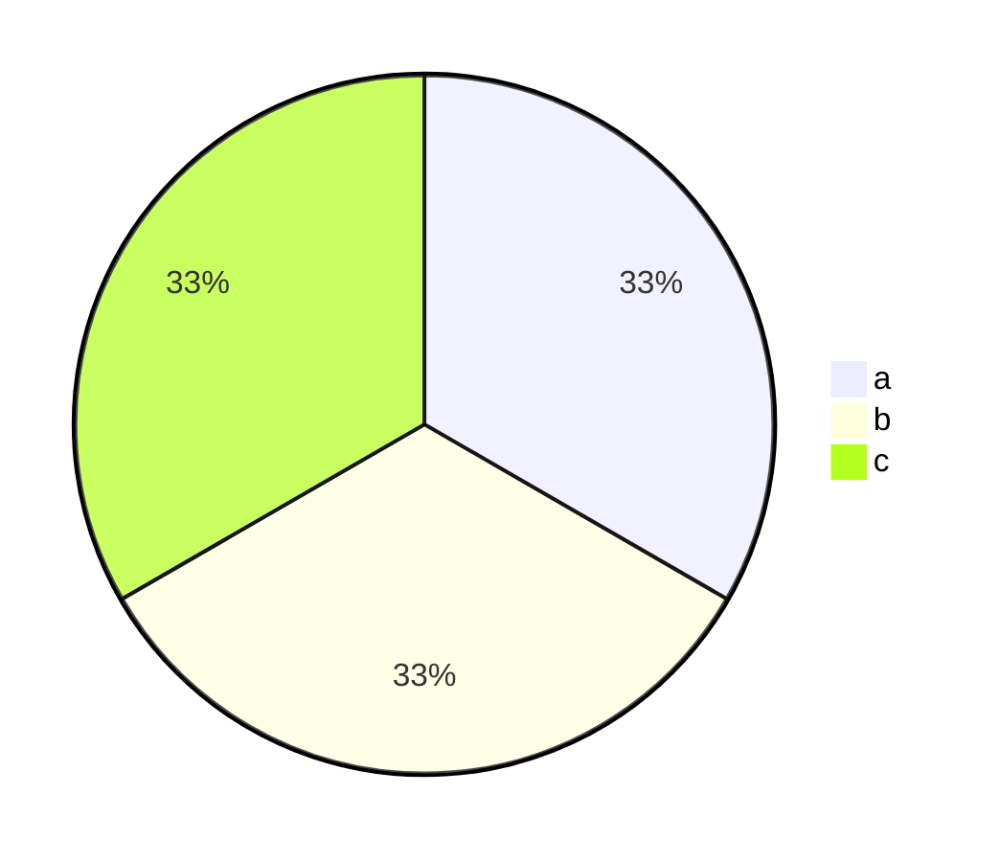
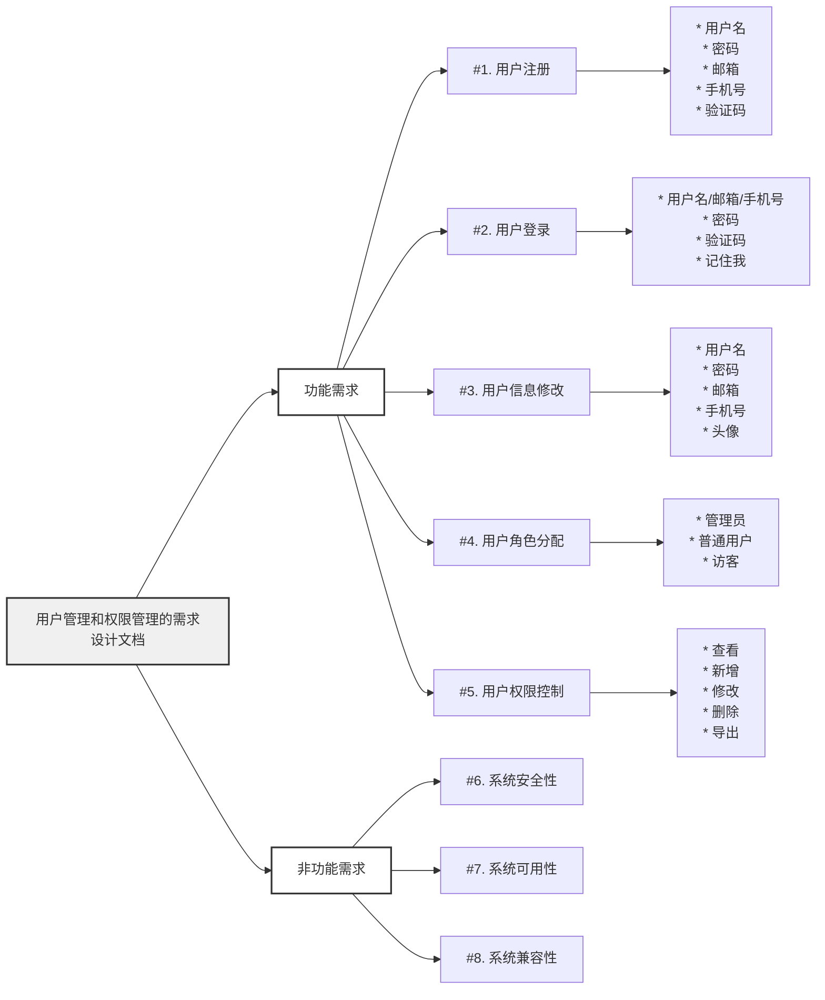
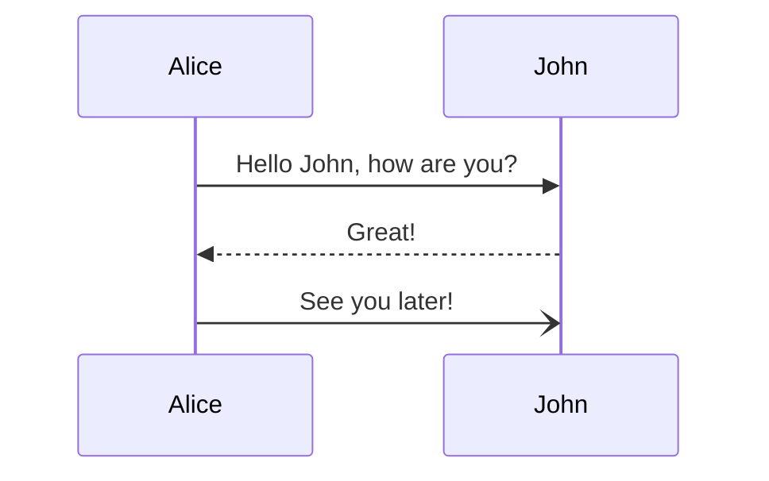
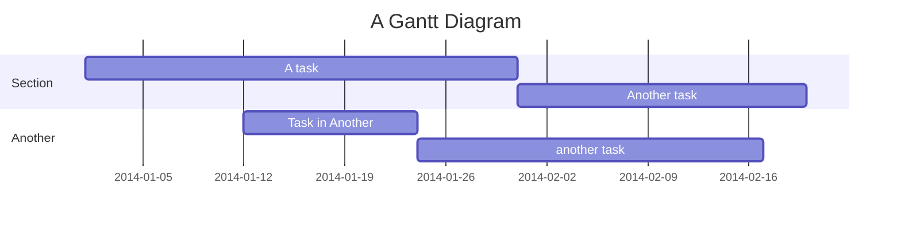
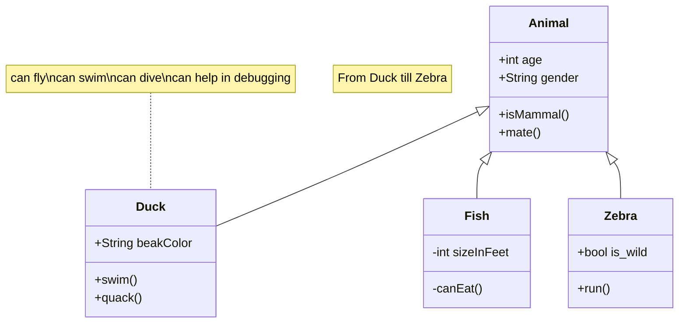

- [ ] 支持icloud, or github同步
[ ] 可以画图，drawio

![[abc.svg]]

```mermaid
pie
"a": 30
"b": 30
"c": 30
```

```mermaid
graph LR

  A[用户管理和权限管理的需求设计文档]

  A --> B["功能需求"]

  A --> C["非功能需求"]

  B --> D[#1. 用户注册]

  B --> E[#2. 用户登录]

  B --> F[#3. 用户信息修改]

  B --> G[#4. 用户角色分配]

  B --> H[#5. 用户权限控制]

  C --> I[#6. 系统安全性]

  C --> J[#7. 系统可用性]

  C --> K[#8. 系统兼容性]

  D --> L[* 用户名\n* 密码\n* 邮箱\n* 手机号\n* 验证码]

  E --> M[* 用户名/邮箱/手机号\n* 密码\n* 验证码\n* 记住我]

  F --> N[* 用户名\n* 密码\n* 邮箱\n* 手机号\n* 头像]

  G --> O[* 管理员\n* 普通用户\n* 访客]

  H --> P[* 查看\n* 新增\n* 修改\n* 删除\n* 导出]

  style A fill:#f0f0f0,stroke:#333,stroke-width:2px;

  style B fill:#fff,stroke:#333,stroke-width:2px;

  style C fill:#fff,stroke:#333,stroke-width:2px;
```

```mermaid
sequenceDiagram
    Alice->>John: Hello John, how are you?
    John-->>Alice: Great!
    Alice-)John: See you later!
```

```mermaid
gantt
    title A Gantt Diagram
    dateFormat YYYY-MM-DD
    section Section
        A task          :a1, 2014-01-01, 30d
        Another task    :after a1, 20d
    section Another
        Task in Another :2014-01-12, 12d
        another task    :24d
```

```mermaid
classDiagram
    note "From Duck till Zebra"
    Animal <|-- Duck
    note for Duck "can fly\ncan swim\ncan dive\ncan help in debugging"
    Animal <|-- Fish
    Animal <|-- Zebra
    Animal : +int age
    Animal : +String gender
    Animal: +isMammal()
    Animal: +mate()
    class Duck{
        +String beakColor
        +swim()
        +quack()
    }
    class Fish{
        -int sizeInFeet
        -canEat()
    }
    class Zebra{
        +bool is_wild
        +run()
    }
```

